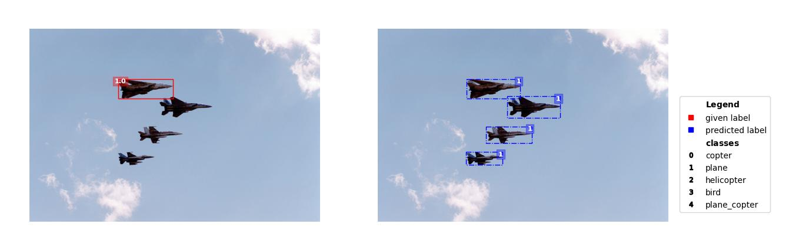

# Сервис выявления проблем в разметке датасетов детекции

## Как работает

Для выявления проблем в разметке используется этот [инструмент](https://github.com/cleanlab/cleanlab)

Данный сервис анализирует датасет в формате yolo-ultralytics, выявляет кадры с проблемной разметкой и заменяет эту разметку на предикт от нейросети.

Полный пайплайн выглядит примерно так:

1) Датасет делится на несколько фолдов.
2) Под каждый фолд обучается своя нейросеть.
3) Каждая нейросеть делает предсказания для тестовой выборки своего фолда. Результаты объединяются.
4) Считаются статистики по некоторому списку признаков. Выявляются аномалии.
5) Результаты сохраняются туда, куда вам нужно. По необходимости кадры с проблемной разметкой визуализируются.

## Первоначальная настройка

Для начала вам необходимо подготовить датасет в формате [yolo-ultralytics](https://docs.ultralytics.com/datasets/detect/)

Таким образом у вас должна получиться папка со следующей структурой:

```
dataset_name
|
└───images
│   │   image_0.jpg
│   │   image_1.jpg
│   │   image_2.jpg
│   │   ...
│   
└───labels
    │   image_0.txt
    │   image_1.txt
    │   image_2.txt
    │   ...

```

Далее необходимо прописать пути в файле docker-compose.yaml

```yaml
...
    volumes:
      - ./path/to/yolo/dataset:/workspace/dataset  # Путь до датасета
      - ./configs/config.yaml:/workspace/configs/config.yaml # Путь до конфига
      - ./drawed/:/workspace/drawed # Путь для изображений с отрисовкой
      - ./results/:/workspace/results # Путь для результатов анализа

...

```
Не меняйте пожалуйста пути внутри контейнера.

Осталось лишь настроить конфиг

```yaml

do_visualize: True  # делать ли визуализацию
num_images_to_vis: 100 # количество изображений для визуализации

Correction: 
  correct_issue_labels: True # заменять ли проблемную разметку предиктом нейронки
  conf_thres: 0.2 # пороговое значение для отсечения боксов во время замены разметки

Dataset:
  num_folds: 5  # количество фолдов
  dataset_path: /workspace/dataset/ # это менять не надо

  names: # названия классов для визуализации
    0: plate
    1: sign
    2: garbage

Training:
  model: yolov8n  # тип модели (yolov8n, yolov8s, yolov8m ...)
  batch: 32 # размер батча во время обучения
  imgsz: 1024 # входной шейп нейросети
  cache: False # загружать ли датасет в оперативку перед обучением
  workers: 8 # количество ядер под dataloader-ы
  epochs: 30 # количество эпох для каждой модели

Inference:
  conf_thres: 0.1 # Порог для предсказаний (лучше не менять)
  iou_thres: 0.5 # Порог для nms


```

Вам не нужна идеальная модель для поиска проблемной разметки, однако от предсказаний нейросетей зависит результат.

Поэтому подбирайте параметры на свое усмотрение, исходя из располагаемых времени и железа. 

Я же рекомендую использовать настолько большую нейросеть и входной шейп, насколько вам позволяет ваша видеокарта. И запускать контейнер на выходные. Оно того стоит.


## Запуск

Когда все настроено нужно поднять контейнер

```
sudo docker compose up -d
```

## Результаты

Как только анализ завершится в папке с результатами появится файл "results.json". Он содержит названия изображений с проблемной разметкой:

```json
[
    {"image_name": "image_31.jpg"}, 
    {"image_name": "image_42.jpg"},
    {"image_name": "image_2024.jpg"},
    ...
]

```

Отрисовку для проблемных изображений вы сможете посмотреть по пути, который указали в docker-compose


Если изначально в конфиге вы указали параметр 
```yaml
correct_issue_labels: True
```
то в рядом с папкой "labels" у вашего датасета появится папка "corrected_labels", внутри нее все та же разметка за исключением проблемных кадров - для них лейблы заменены предсказаниями нейросетей.


## Что с этим делать?

На ваше усмотрение. 

Проанализируйте отрисовку и взгляните на количество найденных проблемных кадров.

Если их совсем немного, или вы, по какой то причине не хотите использовать предсказания нейросетей для последующего обучения, можно просто выкинуть эти кадры из датасета.

Если же проблемных кадров значимое количество, то используйте для обучения своей нейросети "corrected_labels" вместо первоначальных "labels". 


## Пример отрисовки

